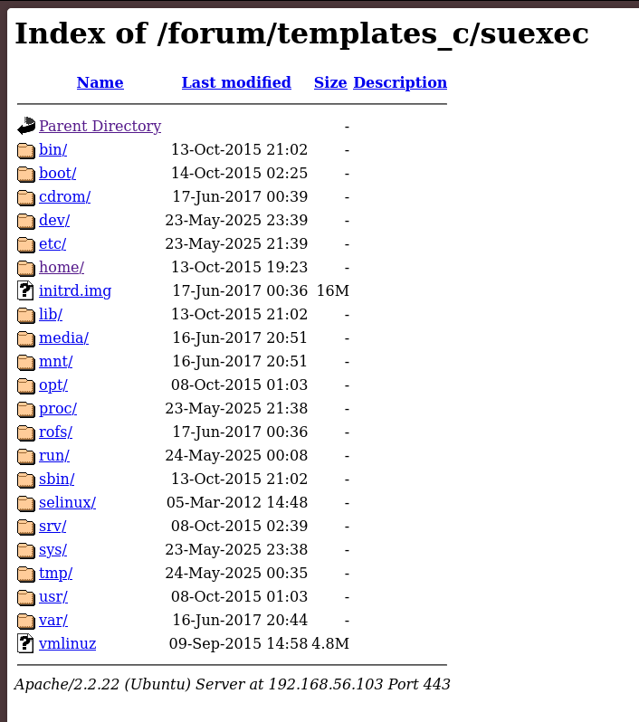

# Writeup 4 - Apache suEXEC

> This writeup takes from [Writeup 1](../writeup1/README.md), having discovered `phpmyadmin` credentials.

This is a small trick we can use to read files via PHP using a vulnerability in Apache 2.2.22 and below *(which is conveniently the version we're running)*. This is especially useful when PHP code is restricted and functions such as `system` are not available.

Instead of using system commands, we can use an oversight in Apache's permissions, exploit named `suEXEC`, to read files with more privileges than the regular apache user.

This exploit works by creating a symlink file to a directory, such as the filesystem root, which lets us snoop around the filesystem and read files :+1:

## Preparation

We'll use `phpmyadmin` to write our initial php script to create the symlink:
```sql
SELECT "<?php symlink('/', '/var/www/forum/templates_c/suexec'); ?>" INTO OUTFILE '/var/www/forum/templates_c/execute.php'
```

Then we can visit the `/execute.php` file to execute our code, and see a new `suexec` directory in the `templates_c` directory, which we can follow to read the filesystem root.

[](./screen-1.png)

Finally, we'll read the `/home/LOOKATME/password` file to get the password for the `lmezard` account.
